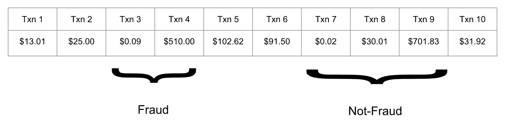
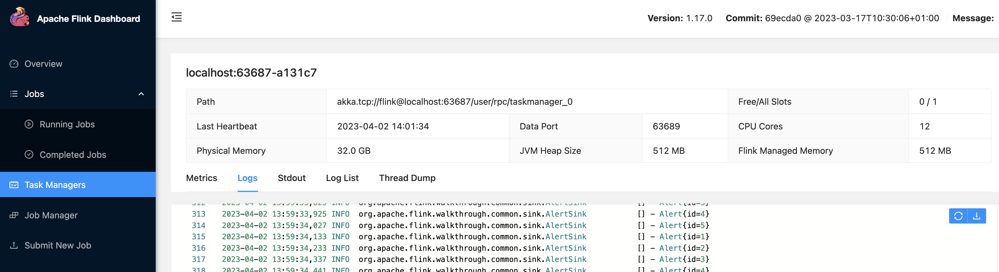

# Flink Fraud Demo
This project illustrates building a Flink streaming application for detecting fraudulent transactions

The project requires Java 11 and Flink 1.17 to run.

Flink can be downloaded from https://flink.apache.org/downloads/

## Fraud Detector
Fraudulent transactions in an account can be detected by certain patterns in a sequence of transactions. An example of a fraudulent transaction is illustrated below with a low value transaction followed immediately by a high value transaction. The full example with details is available at [Fraud Detection Example](https://nightlies.apache.org/flink/flink-docs-release-1.17/docs/try-flink/datastream/).

## Build and Package Streaming Application
1. Build the streaming application

From the project root folder run the following command

`./gradlew build`

 
2. Package the streaming application "uber jar"

From the project root folder run the following command

`./gradlew shadowJar`

The uber jar is assembled and available at `app/libs/<project-name>-<version>-all.jar` 

e.g., `app/build/libs/app-1.0-SNAPSHOT-all.jar`

For more information about the uber jar gradle plugin see https://github.com/johnrengelman/shadow

3. Run the job on Flink

From the project root folder run the following command

`$FLINK_HOME/bin/flink run /Users/ESumitra/workspaces/java/flink-demo1/app/build/libs/app-1.0-SNAPSHOT-all.jar`

## Running Flink
All commands should be run the in FLINK_HOME folder

1. Start Flink

`./bin/start-cluster.sh`

2. View Flink GUI console

In a browser, open the console at http://localhost:8081/

3. Run a Flink Job

`$FLINK_HOME/bin/flink run <path to job streaming app>`

4. View job and task logs

In the GUI console navigate to
Dashboard > Task Manager > Logs and view alerts in the logs

5. Shutdown Flink

`./bin/stop-cluster.sh`

## License and Copyright
Copyright 2023, Edward Sumitra

Licensed under the MIT License.
